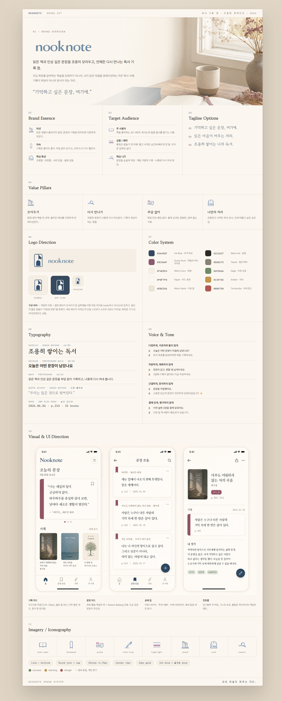

# 디자인 스킬 (designer)

제품 설명 한 줄에서 출발해 **브랜드 정체성 → 자산 → UI 킷 → 구현 문서(DESIGN.md)**까지(designer 핵심)와, 그 뒤 다운스트림(**컴포넌트 export · 페이지 이미지 · 프로토타입 · 코드 생성**)으로 이어지는 디자인 스킬 묶음이다. `designer` 서브에이전트가 이 스킬들을 단계에 맞게 `Skill` 도구로 호출하며 **협업 루프**(만들고 · 보여주고 · 한 번에 하나씩 고치고 · 확정)로 운전한다. 즉흥으로 결과물을 지어내지 않고, 각 단계가 앞 단계의 `.design/` 산출물을 입력으로 받는다.

> **상태:** 현재 `design-brand-kit`이 가장 완성도 높게 정비돼 있어 아래에서 심화로 다룬다. 나머지 스킬은 같은 파이프라인 위에서 순차 정비 중이라 여기서는 역할만 요약한다.

## 파이프라인

```
핵심 파이프라인 (designer):
design-brand-kit  (+ 공유 assets/tokens.css)
   ├─ (선택) design-logo      ← assets/brand-kit/logo-base.png 시드
   ├─ (선택) design-iconset   ← BRAND_KIT.md §11 + brand-tokens.json 근거
   └─ design-ui-kit           ← BRAND_KIT.md §10 + tokens.css + assets/icon/*.svg
          └─ design-md-compiler   → DESIGN.md   (여기까지 designer 핵심)

다운스트림 (주체 · 구현 상태):
   design-component-export   (front-developer · 미구현)
   design-image-web          (designer · 선택, DESIGN.md 시드)
   design-image-mobile       (designer · 선택, DESIGN.md 시드)
   design-html-prototype     (web-publisher)
   design-generate-code      (front-developer · 미구현)
```

| 스킬 | 역할 | 입력 | 주요 산출물 |
|---|---|---|---|
| **design-brand-kit** | 브랜드 정체성·톤·색·타이포·로고 방향·UI 분위기를 정리하고, 정체성 base 자산(투명 PNG)과 한눈에 보는 HTML 오버뷰를 협업으로 만든다. lock 시 `brand-tokens.json`을 `assets/tokens.css`로 물질화(공유 토큰 토대) | 제품 설명 (+ 디스커버리 Q&A) | `.design/{BRAND_KIT.md·brand-tokens.json}`(루트) · `view/overview.html` · `assets/tokens.css` · `assets/brand-kit/` |
| **(선택) design-logo** | 라운드 3~4개 탐색 시트 → 단독 로고 확정 | `assets/brand-kit/logo-base.png` | `.design/assets/logo/` |
| **(선택) design-iconset** | 한 가족으로 읽히는 아이콘 세트를 라벨 그리드 시트로 확정 | `BRAND_KIT.md` §11 · `brand-tokens.json` 근거 | `.design/assets/icon/` |
| **design-ui-kit** | 제품 UI 컴포넌트 라이브러리를 토큰 기반 HTML/CSS로 저작(이미지 아님). lock 후 design-md-compiler 호출 | `BRAND_KIT.md` §10 · `tokens.css` · `assets/icon/*.svg` | `.design/assets/ui-kit/ui-kit.css` · `view/ui-kit.html` |
| **design-md-compiler** | 위 산출물을 구현자가 따를 수 있는 규칙으로 정리(§4 토큰=tokens.css, §5 컴포넌트=ui-kit.css 권위). **designer 핵심 파이프라인의 종착** | 브랜드 킷 + tokens.css + ui-kit.css (페이지 이미지 있으면 선택 입력) | `DESIGN.md` (cwd 루트) |
| **design-component-export** *(front-developer·미구현)* | 확정 ui-kit.css·tokens.css를 대상 프로젝트 컴포넌트 세트로 export | ui-kit.css·tokens.css | (예정) 컴포넌트 세트 |
| **design-image-web** *(designer)* | 웹 풀페이지 목업(세로 1:3) 생성 — HTML 전 룩 탐색. 핵심 이후 *선택* 단계, `design-html-prototype` 직전 | `DESIGN.md` 시드 | 웹 풀페이지 목업 |
| **design-image-mobile** *(designer)* | 앱 화면 목업 생성 — HTML 전 룩 탐색. 핵심 이후 *선택* 단계, `design-html-prototype` 직전 | `DESIGN.md` 시드 | 앱 화면 목업 |
| **design-html-prototype** *(web-publisher)* | DESIGN.md로 풀페이지 HTML 프로토타입을 빌드+QA | `DESIGN.md` + 토큰 | 풀페이지 HTML 프로토타입 |
| **design-generate-code** *(front-developer·미구현)* | 프로토타입+컴포넌트로 실제 페이지·앱 코드 생성 | 프로토타입 + 컴포넌트 세트 | (예정) 페이지·앱 코드 |

핵심 파이프라인의 후속 단계(`design-logo`·`design-iconset`·`design-ui-kit`)는 보드를 다시 분석하지 않고 `design-brand-kit`이 만든 `.design/assets/brand-kit/`를 **직접 시드로**, `assets/tokens.css`를 **공유 토큰 토대로** 읽는다. (`design-image-web`·`design-image-mobile`은 `DESIGN.md`를 시드로 받아 풀페이지/화면 목업을 만들고, `design-html-prototype`으로 넘어가기 전 룩 탐색을 마무리한다.)

이미지 생성은 공유 [`image-gen`](../../skills/image-gen) 스킬(OpenAI Images API)이 담당하며 `OPENAI_API_KEY`(`.env`)가 필요하다. 키가 없으면 이미지 단계만 사람이 직접 드롭하도록 안내하고 나머지는 진행한다.

---

## design-brand-kit (심화)

### 목적

제품 설명만 보고 바로 화면을 만들지 않는다. 먼저 브랜드의 성격·시각 방향·색·타이포·로고 방향·UI 분위기를 정리하고, **정체성 base 자산(로고·워드마크·키비주얼·UI·개별 투명 아이콘)을 안정적 PNG로 생산**한 뒤, 그것들을 끼워넣은 **HTML 오버뷰(`overview.html`)**(개요·에센스·타깃·가치·태그라인·로고·색·타이포·보이스·UI·이미지의 11섹션)를 실제 디자이너처럼 만들어 보여주고 피드백을 받아 반복 수정한다. 데이터 섹션(색·타이포 등)은 토큰에서 **진짜 HEX·실폰트로 HTML 렌더**한다 — 이미지로 굽지 않는다. 품질 기준은 "괜찮은 AI 이미지"가 아니라 **진지한 아이덴티티 스튜디오가 만든 결과물**이다.

### 입력 — 브랜드 디스커버리 Q&A

파일을 만들기 전에 한 번에 하나씩 질문해 입력을 채운다. 추측으로 채우지 않고, 사용자가 명시적으로 위임한 항목만 '미확인'으로 둔다.

- 제품명 · 한 줄 소개 · 주 타깃 사용자 · 핵심 문제와 가치 제안
- 브랜드 성격(페르소나로 추출) · 사용 후 기대 감정 · **피하고 싶은 분위기**
- 레퍼런스 브랜드·스타일 · 기존 색상·로고 여부 · 사용 맥락(웹·모바일·마케팅) · B2B/B2C

Q&A가 끝나면 미감이 **고정**됐는지 **열림**인지 판정한다. 고정이면 단일 방향으로 직행하고, 열림(미감 위임)이면 전략이 다른 **3개 브랜드 방향**을 3열 컨택트 시트(`directions.html`)로 렌더해 한 열을 고르는 게이트를 둔다.

### 흐름 (협업 루프)

1. **킷 작성** — `BRAND_KIT.md`(§1–11) + `brand-tokens.json`. 미감 열림이면 3방향 컨택트 시트 입력(`directions.json`)부터.
2. **승인 게이트 (이미지 0콜)** — 미감 고정이면 data-only `overview.html`(이미지 슬롯은 플레이스홀더)을 제시해 승인받고, 열림이면 컨택트 시트에서 한 방향을 고른다. 승인/선택 전에는 이미지를 **한 장도** 생성하지 않는다.
3. **자산 생산** — `key-visual` → `logo-base` → `wordmark-base` → `ui-base` → `icons/*`를 **한 번에 하나씩** 만들어 보여주고, 피드백은 한 번에 한 가지만 반영해 다시 만든다. (컷아웃은 투명 PNG + autocrop, 사진류만 고품질.)
4. **overview.html 마무리** — 플레이스홀더를 실제 자산으로 채워 마감.
5. **lock** — 산출물은 캐노니컬 홈(루트 `BRAND_KIT.md`·`brand-tokens.json` · `view/overview.html` · `assets/brand-kit/`)에 제자리 저작되며 lock은 "승인" 의미. lock 시 `assets/tokens.css`를 생성(공유 토큰 토대)한다. 다음 단계(`design-logo` → `design-iconset` → `design-ui-kit` → `design-md-compiler`)를 안내한다.

### 산출물 레이아웃

```
.design/
  BRAND_KIT.md  brand-tokens.json     # 루트 스펙/토큰
  view/    overview.html · logos.html · iconset-sheet.html · ui-kit.html · directions.html
  assets/  tokens.css(공유 토큰) · brand-kit/(base 자산·컨셉 아이콘) · logo/ · icon/ · ui-kit/ · page/   # 확정 deliverable
  candidate/  brand-kit/ · logo/ · icon/ · page/                      # 탐색 데이터
```

`overview.html`은 `view/`에서 `../assets/brand-kit/`를 상대경로로 참조한다.

### 예시 — Nooknote

가상의 독서 기록 앱 **Nooknote**로 만든 브랜드 킷 오버뷰다. 아래 프롬프트 한 통으로 시작해 협업 루프를 돌린 결과물이다.

**사용한 프롬프트**

```text
Nooknote라는 가상의 독서 기록 앱 브랜드 키트 이미지를 만들어줘.

Nooknote는 읽은 책을 기록하고, 인상 깊은 문장을 저장하고, 나중에 다시 볼 수 있게 도와주는 앱이야.

주 사용자는 책을 좋아하는 20~40대 사람들이고, 독서노트나 기록을 남기는 걸 좋아하는 사람들이야.

브랜드 느낌은 조용하고 차분했으면 좋겠어. 너무 무겁거나 고전적인 느낌보다는, 편안하게 오래 쓸 수 있는 앱처럼 보였으면 해.

로고는 책, 노트, 책갈피, 문장, 작은 방 같은 이미지가 떠오르면 좋겠어. 너무 학습 앱처럼 딱딱하지는 않았으면 좋겠어.

이 내용을 바탕으로 로고, 색상, 폰트 느낌, 아이콘, 앱 화면이나 기록 카드 예시가 포함된 브랜드 키트 이미지를 만들어줘.
```

**결과물 (`overview.html`)**


