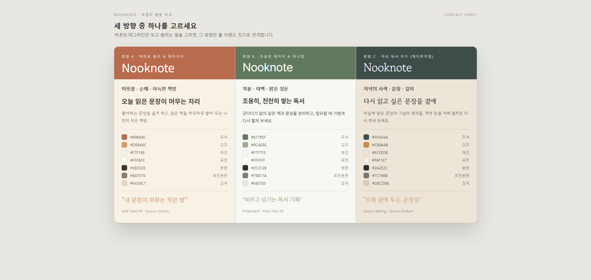
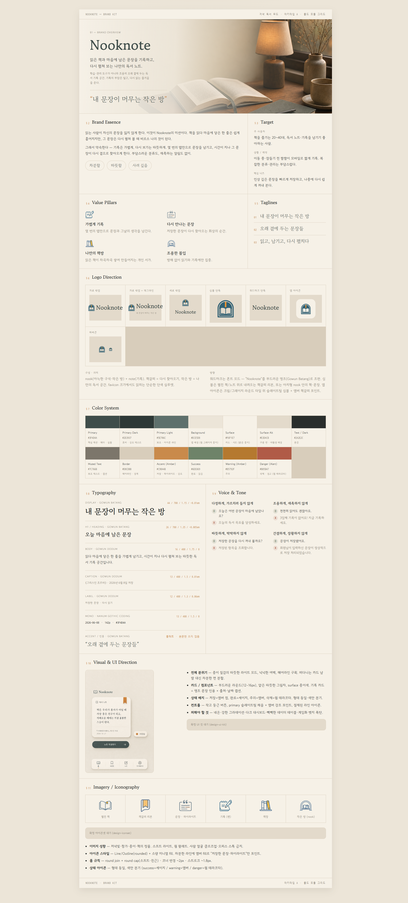
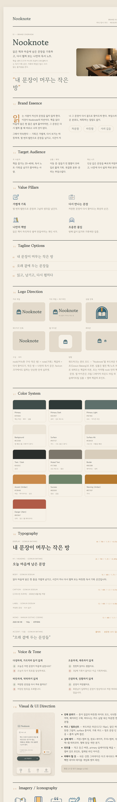
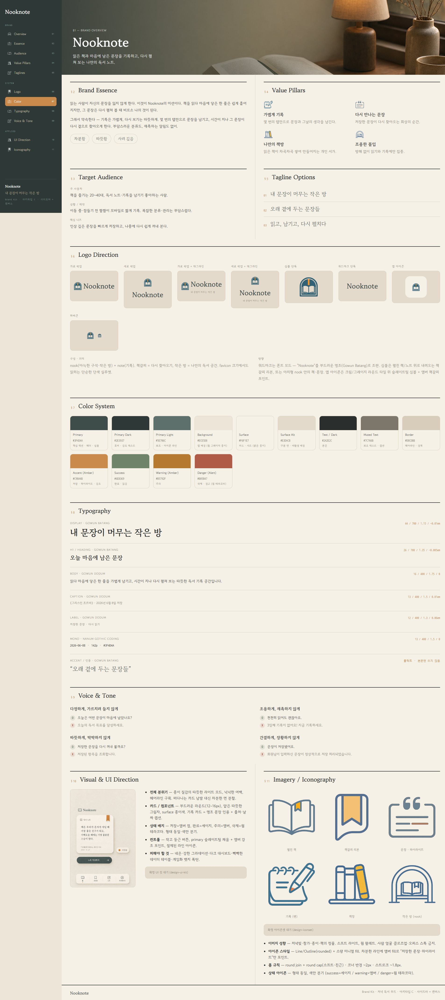
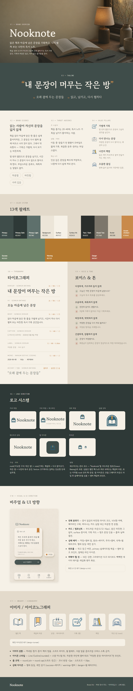
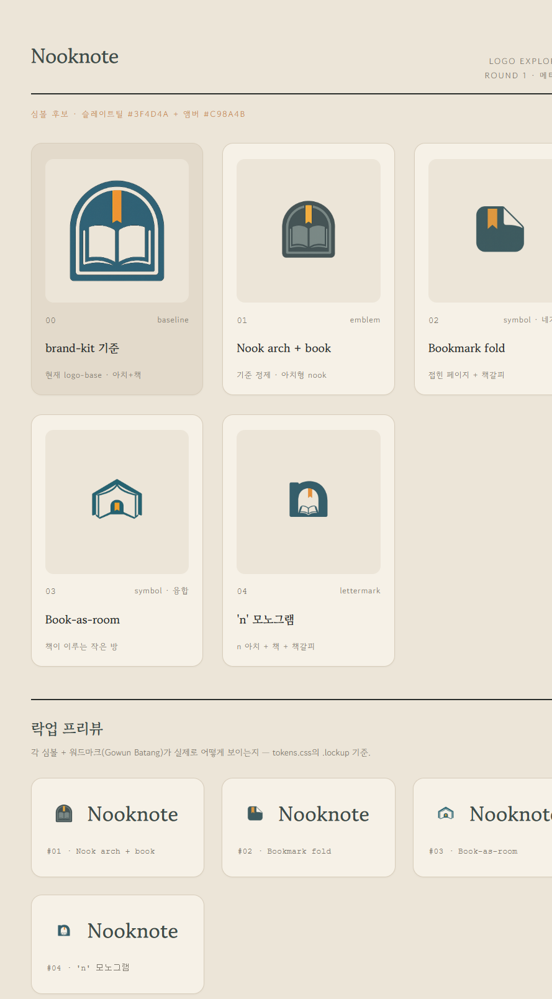
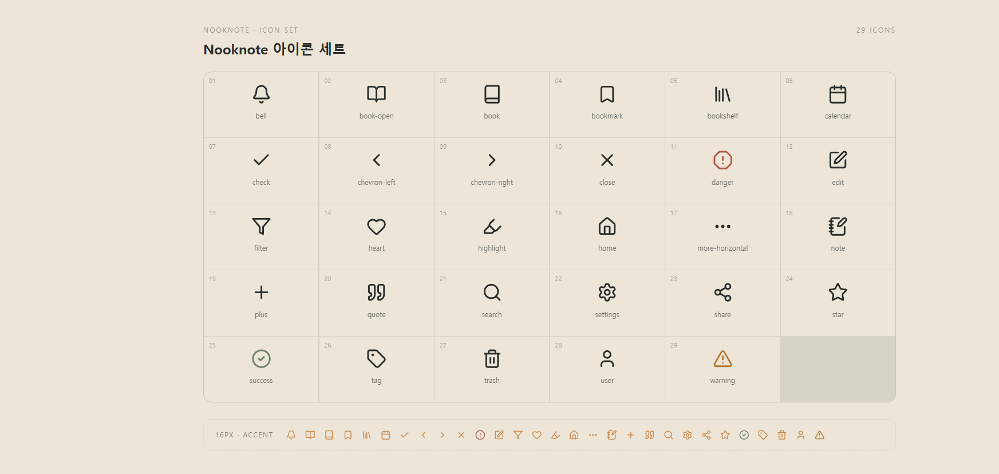
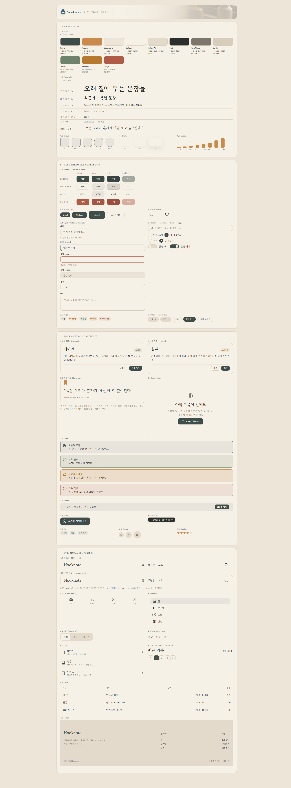

# 디자인 스킬 (designer)

제품 설명 한 줄에서 출발해 **브랜드 정체성 → 자산 → UI 킷 → 구현 문서(DESIGN.md)**까지(designer 핵심)와, 그 뒤 다운스트림(**컴포넌트 export · 페이지 이미지 · 프로토타입 · 코드 생성**)으로 이어지는 디자인 스킬 묶음이다. `designer` 서브에이전트가 이 스킬들을 단계에 맞게 `Skill` 도구로 호출하며 **협업 루프**(만들고 · 보여주고 · 한 번에 하나씩 고치고 · 확정)로 운전한다. 즉흥으로 결과물을 지어내지 않고, 각 단계가 앞 단계의 `.design/` 산출물을 입력으로 받는다.

> **상태:** 현재 `design-brand-kit`이 가장 완성도 높게 정비돼 있어 아래 소개에서 가장 자세히 다룬다. 나머지 스킬은 같은 파이프라인 위에서 순차 정비 중이라 여기서는 역할만 요약한다.

## 파이프라인

```
핵심 파이프라인 (designer):
design-brand-kit  (+ 공유 assets/css/tokens.css)
   ├─ (선택) design-logo      ← reference/brand-kit/logo-base.png 시드
   ├─ design-iconset          ← BRAND_KIT.md §11 + brand-tokens.json 근거 (ui-kit·컴포넌트 필수 입력)
   └─ design-ui-kit           ← BRAND_KIT.md §10 + tokens.css + assets/icon/*.svg
          └─ design-md-compiler   → .design/DESIGN.md   (여기까지 designer 핵심)

다운스트림 (주체 · 구현 상태):
   design-component-export-react   (front-developer)
   design-component-export-html    (front-developer · 미구현)
   design-image-web          (designer · 선택, DESIGN.md 시드)
   design-image-mobile       (designer · 선택, DESIGN.md 시드)
   design-html-prototype     (web-publisher)
   design-generate-code      (front-developer · 미구현)
```

| 스킬 | 역할 | 입력 | 주요 산출물 |
|---|---|---|---|
| **design-brand-kit** | 브랜드 정체성·톤·색·타이포·로고 방향·UI 분위기를 정리하고, 정체성 base 자산(투명 PNG)과 한눈에 보는 HTML 오버뷰를 협업으로 만든다. lock 시 `brand-tokens.json`을 `assets/css/tokens.css`로 물질화(공유 토큰 토대) | 제품 설명 (+ 디스커버리 Q&A) | `reference/{BRAND_KIT.md·brand-tokens.json}` · `view/overview.html` · `assets/css/tokens.css` · `reference/brand-kit/` |
| **(선택) design-logo** | 라운드 3~4개 탐색 시트 → 단독 로고 확정 | `reference/brand-kit/logo-base.png` | `.design/assets/logo/` |
| **design-iconset** | 한 가족으로 읽히는 아이콘 세트를 라벨 그리드 시트로 확정. 산출 `assets/icon/*.svg`는 **design-ui-kit·컴포넌트 제작의 필수 입력** | `BRAND_KIT.md` §11 · `brand-tokens.json` 근거 | `.design/assets/icon/` |
| **design-ui-kit** | 제품 UI 컴포넌트 라이브러리를 토큰 기반 HTML/CSS로 저작(이미지 아님). lock 후 design-md-compiler 호출 | `BRAND_KIT.md` §10 · `tokens.css` · `assets/icon/*.svg` | `.design/assets/css/ui-kit.css` · `view/ui-kit.html` |
| **design-md-compiler** | 위 산출물을 구현자가 따를 수 있는 규칙으로 정리(§4 토큰=tokens.css, §5 컴포넌트=ui-kit.css 권위). **designer 핵심 파이프라인의 종착** | 브랜드 킷 + tokens.css + ui-kit.css (페이지 이미지 있으면 선택 입력) | `.design/DESIGN.md` |
| **design-component-export-react** *(front-developer)* | 확정 ui-kit 자산을 repo 루트의 react(Vite)/next(App Router) 컴포넌트 토대로 물질화(얇은 className 래퍼 + 내재 동작 hook + 쇼케이스) | tokens.css·ui-kit.css·ui-kit.html·icon·logo | repo 루트 npm 프로젝트 컴포넌트 토대 |
| **design-component-export-html** *(front-developer·미구현)* | 같은 입력 → html/MPA(jsp/php 블록) 산출 | 동일 ui-kit 자산 | (예정) html/MPA 블록 |
| **design-image-web** *(designer)* | 웹 풀페이지 목업(세로 1:3) 생성 — HTML 전 룩 탐색. 핵심 이후 *선택* 단계, `design-html-prototype` 직전 | `DESIGN.md` 시드 | 웹 풀페이지 목업 |
| **design-image-mobile** *(designer)* | 앱 화면 목업 생성 — HTML 전 룩 탐색. 핵심 이후 *선택* 단계, `design-html-prototype` 직전 | `DESIGN.md` 시드 | 앱 화면 목업 |
| **design-html-prototype** *(web-publisher)* | DESIGN.md로 풀페이지 HTML 프로토타입을 빌드+QA | `DESIGN.md` + 토큰 | 풀페이지 HTML 프로토타입 |
| **design-generate-code** *(front-developer·미구현)* | 프로토타입+컴포넌트로 실제 페이지·앱 코드 생성 | 프로토타입 + 컴포넌트 세트 | (예정) 페이지·앱 코드 |

핵심 파이프라인의 후속 단계(`design-logo`·`design-iconset`·`design-ui-kit`)는 보드를 다시 분석하지 않고 `design-brand-kit`이 만든 `.design/reference/brand-kit/`를 **직접 시드로**, `assets/css/tokens.css`를 **공유 토큰 토대로** 읽는다. (`design-image-web`·`design-image-mobile`은 `DESIGN.md`를 시드로 받아 풀페이지/화면 목업을 만들고, `design-html-prototype`으로 넘어가기 전 룩 탐색을 마무리한다.)

이미지 생성은 공유 [`image-gen`](../../skills/image-gen) 스킬(OpenAI Images API)이 담당하며 `OPENAI_API_KEY`(`.env`)가 필요하다. 키가 없으면 이미지 단계만 사람이 직접 드롭하도록 안내하고 나머지는 진행한다.

---

## 핵심 파이프라인 스킬별 소개

`design-brand-kit`부터 `design-md-compiler`까지 designer 핵심 파이프라인의 다섯 단계. 각 스킬의 산출물 예시 이미지는 추후 추가한다.

### design-brand-kit

제품 설명 한 줄에서 브랜드 성격·시각 방향·색·타이포·로고 방향·UI 분위기·금지 패턴을 정리하고, 정체성 base 자산(로고·워드마크·키비주얼·UI·개별 투명 아이콘)을 안정적 PNG로 생산한 뒤 그것들을 끼워넣은 **HTML 오버뷰(`overview.html`)**를 협업으로 만든다. lock 시 `brand-tokens.json`을 공유 `assets/css/tokens.css`로 물질화한다.

#### 목적

제품 설명만 보고 바로 화면을 만들지 않는다. 먼저 브랜드의 성격·시각 방향·색·타이포·로고 방향·UI 분위기를 정리하고, **정체성 base 자산(로고·워드마크·키비주얼·UI·개별 투명 아이콘)을 안정적 PNG로 생산**한 뒤, 그것들을 끼워넣은 **HTML 오버뷰(`overview.html`)**(개요·에센스·타깃·가치·태그라인·로고·색·타이포·보이스·UI·이미지의 11섹션)를 실제 디자이너처럼 만들어 보여주고 피드백을 받아 반복 수정한다. 데이터 섹션(색·타이포 등)은 토큰에서 **진짜 HEX·실폰트로 HTML 렌더**한다 — 이미지로 굽지 않는다. 품질 기준은 "괜찮은 AI 이미지"가 아니라 **진지한 아이덴티티 스튜디오가 만든 결과물**이다.

#### 입력 — 브랜드 디스커버리 Q&A

파일을 만들기 전에 한 번에 하나씩 질문해 입력을 채운다. 추측으로 채우지 않고, 사용자가 명시적으로 위임한 항목만 '미확인'으로 둔다.

- 제품명 · 한 줄 소개 · 주 타깃 사용자 · 핵심 문제와 가치 제안
- 브랜드 성격(페르소나로 추출) · 사용 후 기대 감정 · **피하고 싶은 분위기**
- 레퍼런스 브랜드·스타일 · 기존 색상·로고 여부 · 사용 맥락(웹·모바일·마케팅) · B2B/B2C

Q&A가 끝나면 미감이 **고정**됐는지 **열림**인지 판정한다. 고정이면 단일 방향으로 직행하고, 열림(미감 위임)이면 전략이 다른 **3개 브랜드 방향**을 3열 컨택트 시트(`directions.html`)로 렌더해 한 열을 고르는 게이트를 둔다.

#### 미감 고정 vs 열림 — 3방향 발산 게이트

미감 축(시각 방향)은 다른 항목과 다르게 다룬다. 제품 사실(제품명·타깃·문제)은 항상 하나로 확정하지만, **미감은 좁혀 짜내기보다 발산시켜 고르게** 하는 편이 쉽다. Q&A 종료 시 둘 중 하나로 분기한다.

- **고정 → 1개 직행**: 명확한 무드·레퍼런스·스타일로 단일 방향이 정해진 경우(예: "미니멀 에디토리얼, Linear 같은 느낌"). 컨택트 시트 없이 바로 캐노니컬 홈에 작업한다.
- **열림 → 3개 발산**: 미감을 명시 위임("AI한테 맡길게")했거나 기능 정보만 주고 미감 스티어가 없는 경우. 미감을 하나로 파고드는 대신 **전략이 다른 3개 브랜드 방향**으로 발산한다.

발산 게이트의 동작:

1. 3방향 최소 데이터를 `candidate/brand-kit/directions.json`(방향별 무드·팔레트·폰트 1쌍·태그라인)으로 적는다 — 풀 킷 3벌이 아니다.
2. `scripts/build-contact-sheet.mjs`가 이를 입력으로 **3열 컨택트 시트 `view/directions.html`**을 결정적으로 만든다. 색은 실 HEX, 폰트는 실폰트 CDN으로 렌더돼 **눈으로 보고** 고른다.
3. 사용자가 한 열을 선택 → 그 1벌만 캐노니컬 홈에 전개한다. **이 게이트까지 이미지 생성은 0콜.**


> 3방향 발산 컨택트 시트 — 색·폰트·태그라인만 보고 끌리는 한 열을 고르면, 그 방향만 풀 브랜드 킷으로 전개된다.

세 방향의 출발 아키타입은 **① 안전한 SaaS형 · ② 프리미엄 에디토리얼형 · ③ 대담한 실험형**이되, 제품 무드(페르소나·기대 감정·피해야 할 분위기)에 맞춰 또렷이 다른 세 방향으로 구체화한다 — "같은 브랜드의 세 해석"이 아니라 성격·팔레트·타이포·보이스·UI가 방향별로 갈라진다. 특히 **피해야 할 분위기**는 세 방향 모두의 공통 제약이다. 발산이면 방향마다 다른 [레이아웃 아키타입](#레이아웃-아키타입-ad)을 배정해 구조까지 갈라지게 한다.

#### 레이아웃 아키타입 (A~D)

`overview.html`은 "포스터 한 장" 느낌의 브랜드 가이드다. 단일 모범답안이 아니라 **동등한 4개 메뉴**에서 브랜드 성격에 맞는 하나를 고르거나 블렌딩한다(A로 흘려보내지 않는다). 고른 아키타입과 한 줄 근거를 `brief.md`에 먼저 적고 그 골격을 따라 저작하며, 마크업 저작·QA는 web-publisher에 위임한다.

| A — 룰드 모듈 그리드 | B — 에디토리얼 스프레드 |
|:---:|:---:|
|  |  |
| 헤어라인 모듈 격자 · 시스템틱·정연 — 테크·SaaS·정밀·중립 | 비대칭·여백·세리프 풀쿼트 — 럭셔리·문학·에디토리얼·따뜻함 |

| C — 사이드바 + 캔버스 | D — 스택 밴드 |
|:---:|:---:|
|  |  |
| 좌측 내비 + 우측 캔버스 · 강한 대비 — 프로덕트·대시보드·앱 | 풀폭 컬러 밴드 · 큰 타입 — 마케팅·대담·실험 |

선택 규칙: 미감·페르소나·무드로 고른다(accent 세리프가 있고 따뜻/에디토리얼이면 B, 차분/미니멀이면 D는 피함). 블렌딩 허용 — 예: "C 골격 + B의 세리프 풀쿼트"처럼 근거에 명시한다. 개별 골격(구조·CSS 스켈레톤·불변·자유 존)은 `skills/design-brand-kit/references/archetypes/<name>.md`에 있다.

#### 흐름 (협업 루프)

1. **킷 작성** — `BRAND_KIT.md`(§1–11) + `brand-tokens.json`. 미감 열림이면 3방향 컨택트 시트 입력(`directions.json`)부터.
2. **승인 게이트 (이미지 0콜)** — 미감 고정이면 data-only `overview.html`(이미지 슬롯은 플레이스홀더)을 제시해 승인받고, 열림이면 컨택트 시트에서 한 방향을 고른다. 승인/선택 전에는 이미지를 **한 장도** 생성하지 않는다.
3. **자산 생산** — `key-visual` → `logo-base` → `wordmark-base` → `ui-base` → `icons/*`를 **한 번에 하나씩** 만들어 보여주고, 피드백은 한 번에 한 가지만 반영해 다시 만든다. (컷아웃은 투명 PNG + autocrop, 사진류만 고품질.)
4. **overview.html 마무리** — 플레이스홀더를 실제 자산으로 채워 마감.
5. **lock** — 산출물은 캐노니컬 홈(`reference/{BRAND_KIT.md·brand-tokens.json}` · `view/overview.html` · `reference/brand-kit/`)에 제자리 저작되며 lock은 "승인" 의미. lock 시 `assets/css/tokens.css`를 생성(공유 토큰 토대)한다. 다음 단계(`design-logo` → `design-iconset` → `design-ui-kit` → `design-md-compiler`)를 안내한다.

#### 산출물 레이아웃

```
.design/
  index.html · DESIGN.md                # 진입점 + 스펙 (DESIGN.md는 .design/ 안)
  view/    overview.html · logos.html · iconset-sheet.html · ui-kit.html · directions.html
  assets/  css/{tokens.css,ui-kit.css} · icon/{*.svg,icon-map.json,vendor/*.svg} · logo/ · content/ · manifest.json   # 코드 import 전용
  prototype/ index.html                 # 참고 구현 (.design/ 안)
  reference/ BRAND_KIT.md · brand-tokens.json · manifest.json · brand-kit/ · page/   # 비-코드 자료
  candidate/ logo/ · icon/ · brand-kit/ · page/ · ui-kit/                            # 탐색
```

`overview.html`은 `view/`에서 `../reference/brand-kit/`를 상대경로로 참조한다.

#### 예시 — Nooknote

가상의 독서 기록 앱 **Nooknote**로 만든 브랜드 킷 오버뷰다. 아래 프롬프트 한 통으로 시작해 협업 루프를 돌린 결과물이다.

**사용한 프롬프트**

```text
Nooknote라는 가상의 독서 기록 앱 브랜드 키트 이미지를 만들어줘.

Nooknote는 읽은 책을 기록하고, 인상 깊은 문장을 저장하고, 나중에 다시 볼 수 있게 도와주는 앱이야.

주 사용자는 책을 좋아하는 20~40대 사람들이고, 독서노트나 기록을 남기는 걸 좋아하는 사람들이야.

브랜드 느낌은 조용하고 차분했으면 좋겠어. 너무 무겁거나 고전적인 느낌보다는, 편안하게 오래 쓸 수 있는 앱처럼 보였으면 해.

로고는 책, 노트, 책갈피, 문장, 작은 방 같은 이미지가 떠오르면 좋겠어. 너무 학습 앱처럼 딱딱하지는 않았으면 좋겠어.

이 내용을 바탕으로 로고, 색상, 폰트 느낌, 아이콘, 앱 화면이나 기록 카드 예시가 포함된 브랜드 키트 이미지를 만들어줘.
```

이 프롬프트로 미감 **열림**(3방향 발산)을 거쳐 만든 오버뷰가 위 [레이아웃 아키타입 (A~D)](#레이아웃-아키타입-ad)의 예시들이다 — 같은 Nooknote 브랜드를 네 가지 레이아웃 아키타입으로 전개한 결과물(B 에디토리얼 스프레드가 확정안).

### design-logo

brand-kit 로고가 마음에 들지 않거나 단순히 프로젝트 로고를 만들 때 쓰는 온디맨드 단계. `reference/brand-kit/logo-base.png`(투명)를 시드로, 한 라운드에 3~4개 방향을 개별 투명 PNG로 만들어 `logos.html` 탐색 시트(번호·라벨·실색·실폰트)로 보여주고 단독 로고를 확정해 `assets/logo/`로 lock한다.



### design-iconset

확정 brand kit를 바탕으로 제품 아이콘 세트를 **Iconify 단일 세트에서 fetch**해 만든다. 후보 세트를 §11 스타일로 점수화해 1개 lock하고, 리스트 적중률을 측정한 뒤, 적중분은 `viewBox 0 0 24 24`·`currentColor`로 정규화해 가져오고 부족분만 합성·저작한다. 모든 아이콘을 `icon-map.json`에 기록하고 `assets/icon/`으로 lock한다. (네트워크 필요, 키 불필요.)

이 세트(`assets/icon/*.svg`)는 이후 **design-ui-kit이 컴포넌트(버튼·인풋·내비 등)를 저작할 때와 다운스트림 컴포넌트 제작(design-component-export-react)에서 필수로 쓰이므로**, 로고와 달리 **핵심 파이프라인의 필수 단계**다.



### design-ui-kit

확정 brand kit 위에 제품에서 바로 쓰는 **UI 컴포넌트 라이브러리를 HTML/CSS 코드로 직접 저작**한다(이미지 아님). 컴포넌트를 4그룹(Foundations/Core Interactive/Informational/Structural)으로 확정하고 스타일 방향을 합의한 뒤, 토큰 변수만 참조하는 `assets/css/ui-kit.css`를 저작한다. 쇼케이스 `view/ui-kit.html` 마크업·QA는 web-publisher에 위임. lock 후 design-md-compiler를 호출한다.



### design-md-compiler

브랜드 킷·UI 킷·(있으면) 페이지 이미지 브리프를 바탕으로 외부 도구에서도 단독 활용 가능한 **`DESIGN.md`**를 만든다. 토큰 frontmatter(§4 = `tokens.css` 권위) + 컴포넌트 산문(§5 = `ui-kit.css` 권위)으로, 실제 구현자가 그대로 따를 수 있는 규칙으로 컴파일한다. **designer 핵심 파이프라인의 종착.**

> 📄 산출 예시 — **[NookNote DESIGN.md](assets/design-md-example.md)** (토큰 frontmatter + §1~12 산문 전문)
